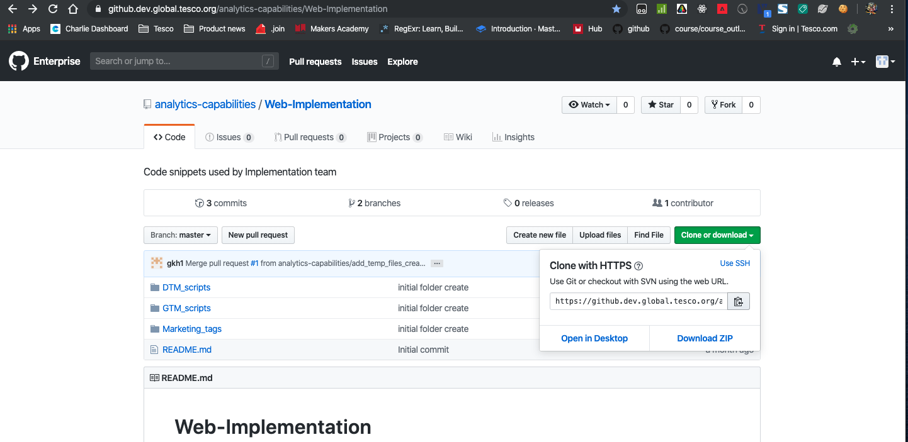

# Git and Github

GTM scripts will sit within a central Github repo and requires you to have a clone of the repo on your local machine. The below will be useful commands you will need. 
Git is a version control system that keeps track of any code changes.
Github 

### Install git on your machine

Check if you have git installed on your machine `git --version`

### Cloning a Repositary 

1. Navigate to the repo where your scripts are stored  
2. Click on Clone and Download and click the copy link icon to the right of the URL  

3. Open up your terminal and navigate to the folder you wish to clone the Repo to - `cd <folder>`
4. Type `git clone <paste repo URL>`

### Creating and naming a new branch

You will need to create a new branch for the changes you make on the Repo and this branch will need to be reviewed by the team before it is merged into the develop branch.
To create a new branch type `git branch <branch name>`

Follow the below naming convention
<em> ticket number-short description of ticket </em>
for example <em>BPTI-1414-update-facebook-pixels</em>

### Changing in between branches

Make sure any changes are committed before you change branches or you will lose the work you have done. To switch branch use `git checkout <branch name>`

### Add coding to staging and Committing

When you have made necessary changes to your code you will need to add the files you edited into a staging area that tells Git that you want to include those files in your next commit.

`git add <file name> <another file name>` adds individual files
`git add .` adds everything in the current folder

To make a meaningful commit it is important to label your commits.

`git commit -m <a description about your commit>`
eg ` git commit -m 'pageData - Add pageData event listener'`

Make frequent and meaningfull commits.
You can check which files needs to be added to staging or commited using `git status`

### Pushing to Github

At this point all the work and commits are on your local machine. You will need to push this into the GitHub repo to make it available to the team or GTM.
`git push -u origin <branch name>` this will be the command if you are pushing with this branch the first time
`git push` thereafter, will push to the code to the branch you defined above

### Pull the code 

There will be instances where you will need to pull the latest code from the dev branch or another branch. For instance when you need to merge the code from your branch with the dev branch and there are conflicts that will need to be sorted.

`git pull origin <the branch you are pulling from>`

### Deleting Branches

When your changes have been merged or pushed to productions you may want to delete the branch.
